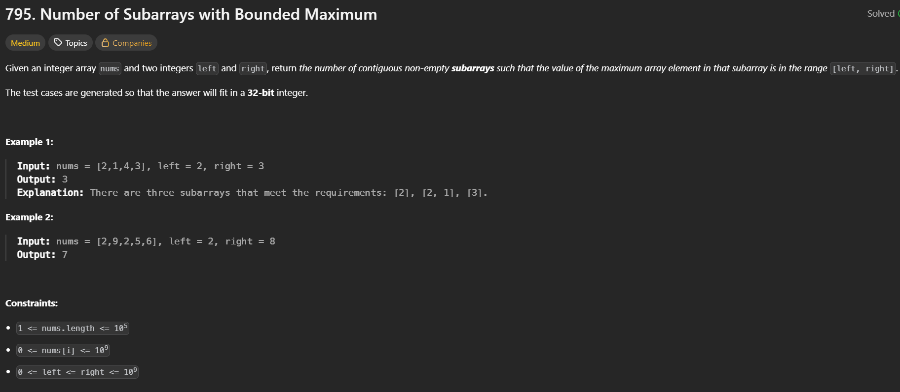

PROBLEM LINK : https://leetcode.com/problems/number-of-subarrays-with-bounded-maximum/description/


Solution :

# 1. Problem Statement (Short)
    Given array nums and range [left, right]
    Count subarrays where maximum element lies in [left, right]

# 2. Intuition / Thinking Process
    Directly maximum track karna hard hai for every subarray
    Key Observation:

    Instead of finding: max ∈ [left, right]

    We can think: count(max ≤ right) - count(max < left)

    मतलब: Subarrays where max ≤ right
    Minus subarrays where max < left= answer

# 3. Brute Force Approach
    Idea: Generate all subarrays
    Find max for each
    Check if in range
    TC:
    O(n²) subarrays × O(n) max → O(n³)
    SC:
    O(1)

    ❌ Too slow

# 4. Better Approach
    Idea: Maintain max while expanding subarray
    Steps:
    Fix left index
    Expand right
    Track max
Code (LeetCode format)
```cpp
class Solution {
public:
    int numSubarrayBoundedMax(vector<int>& nums, int left, int right) {
        int n = nums.size();
        int count = 0;
        
        for(int i = 0; i < n; i++){
            int maxi = nums[i];
            for(int j = i; j < n; j++){
                maxi = max(maxi, nums[j]);
                if(maxi >= left && maxi <= right)
                    count++;
            }
        }
        return count;
    }
};
```
    ⏱ Complexity
    TC: O(n²)
    SC: O(1)
# 5. Optimal Approach
🔥 Core Idea: Count subarrays with:

    max ≤ right  → f(right)
    max < left   → f(left-1)

    Answer = f(right) - f(left-1)

    How to count f(bound)?

    👉 Count subarrays where all elements ≤ bound

    Trick:
    If element > bound → break window
    Else → extend window

    👉 Use variable len:

    length of current valid subarray
    Add len to answer
✅ Code (LeetCode format)
```cpp
class Solution {
public:
    int countValid(vector<int>& nums, int bound){
        int count = 0, len = 0;
        
        for(int x : nums){
            if(x <= bound){
                len++;          // extend window
                count += len;   // all subarrays ending here
            } else {
                len = 0;        // reset window
            }
        }
        return count;
    }
    
    int numSubarrayBoundedMax(vector<int>& nums, int left, int right) {
        return countValid(nums, right) - countValid(nums, left - 1);
    }
};
```
    ⏱ Complexity (Short & Clear)
    TC: O(n)
    SC: O(1)
    🧠 6. Pattern / Concept Used
    🔥 Pattern:

    👉 Sliding Window (Counting Subarrays)
    👉 AtMost Trick

    exact range = atMost(right) - atMost(left-1)

# 7. Trick to Remember

    👉 Whenever:

    "exact condition" difficult
    → convert to atMost / less than

    🔥 Golden Trick:

    exact = atMost(k) - atMost(k-1)

# 8. When to Use This Pattern

    Use when: Subarray count problem
    Condition monotonic (≤, ≥ type)
    All elements positive or constraint-based filtering

    ❌ Not use when:

    Negative numbers + sum based (then prefix sum needed)

# 9. Similar Patterns / Variations
    Condition	Pattern
    sum == k	prefix sum + hashmap
    sum ≤ k	sliding window
    exact k	atMost(k) - atMost(k-1)
    bounded max	same trick
    
# 10. Similar LeetCode Questions
    LeetCode 930 – Binary Subarrays With Sum
    LeetCode 1248 – Count Number of Nice Subarrays
    LeetCode 992 – Subarrays with K Different Integers
    LeetCode 713 – Subarray Product Less Than K